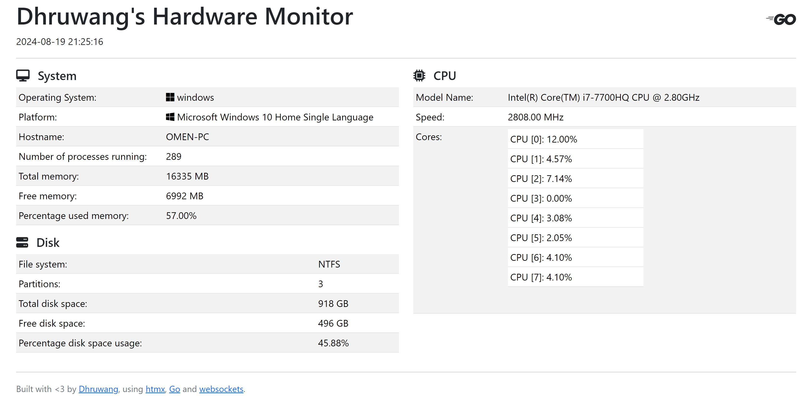

# Hardware Monitor Display

Leveraging the power of websockets and htmx using Go, I made a Server where all the information about a hardware monitor is displayed and updated live. Think of it as a task manager where you can see key details of a hardware monitor updated in real-time.

## Example of the server

## How to run the project

1. Clone this project using `git clone https://github.com/dhruwanga19/go-cpu-info-htmx-ws.git`
2. `cd go-cpu-info-htmx-ws`
3. Run `go run cmd/main.go` in your terminal
4. Open `localhost:8080` in your browser and you have your own hardware monitor details!
